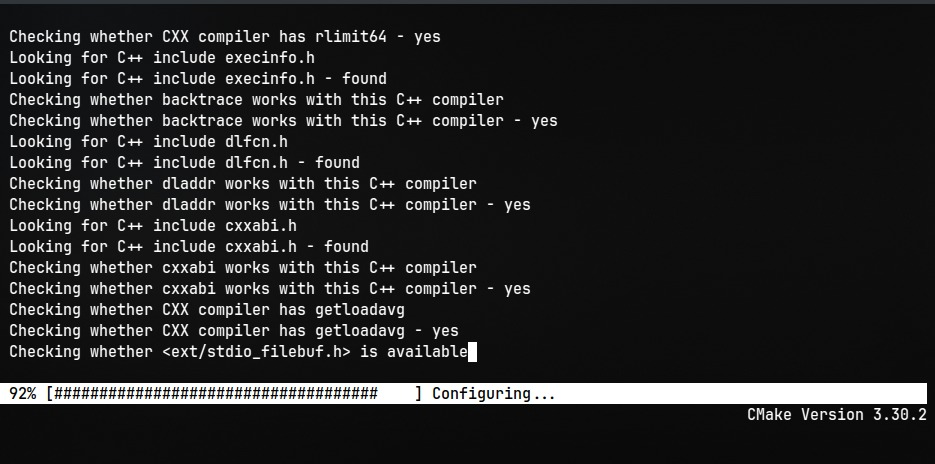
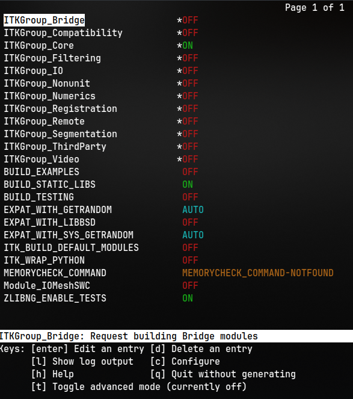

# Configuring ITK using CMake

ITK is a toolkit, once it installed on your computer it does not provide an application to run. On the other hand it provides a set of binaries which could be utilized to create your own application.

ITK is a cross-platform library. The challenge of supporting across platforms has been solved through the use of CMake.

### Minimum Requirements

- GCC 7 or newer
- Visual Studio 2017 v15.7 or newer
- Xcode 10.0 or newer

## Obtaining the software

visit [ITK](https://docs.itk.org/en/latest/download.html) for official releases artifacts

for linux distributions itk is available through various package managers

for debian based users,

```
sudo apt-get install libinsighttoolkit5-dev
```

if you are a homebrew user,

```
brew install itk
```

### Python Wrapping

```
pip install --upgrade pip
pip install itk
```

### Sample Data

https://www.nlm.nih.gov/research/visible/visible_human.html.

https://www.itk.org/ITK/resources/links.html

ftp://public.kitware.com/pub/itk/Data/.

## Preparing CMake

### What is CMake?

CMake is a cross-platform, open-source build system. CMake controls the software compilation process with simple platform and compiler-independent configuration files.

Download CMake from here [CMake](https://cmake.org/)

### Initial Configuration

For the ease and effective use of CMake I recommend CLI version. But a promising tutorial with gui implementations could be found [here](https://www.youtube.com/watch?v=vZOMu5YSfoI).

1. Create two folders named 'src' and 'bin'. **_src_** will consist of the source codes where you need to retrieve the codes from the above links or by cloning the repository. **_bin_** will have the build files.
2. after creating the folders navigate to the bin directory and type,

   ```
   ccmake ../<path to your directory>
   ```
3. This will configure according the built in configurations. and you will be seeing a similar window as below

   
4. Here if we twea ITK_BUILD_DEFAULT_MODULES into false. You will be able to configure the groups you want. If you need more customization options press 't' to switch in to advanced mode where you can see the available modules. Please note that every time you make changes to this configuration you need to press 'c' to generate new configurations. The below is a similar image after configuration with disabling ITK_BUILD_DEFAULT_MODULES.

   
5. Each group has its own implemetations refer the official documentation to learn more about the Grops.
6. After configuring press 'g' to generate make files. After a succesfull generation cmake will be closing quitely.
7. After generating makefiles. type,

   ```
   make
   ```
8. This will trigger to compile the library files after compilation you can see executables for the installation.
9. In windows after generating make files you can see a solution file name "build.sln" open that solution file using visual studio and you can compite the library and generate the installation files.
